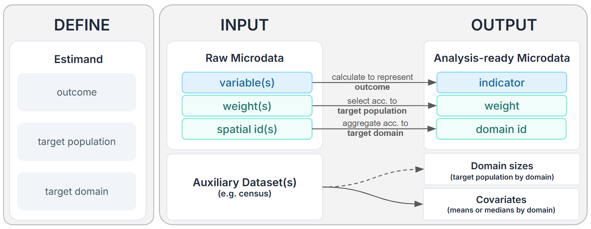

Raw survey microdata is transformed into analysis-ready inputs by defining the estimand, coding the indicator from the survey variables, aligning it with the target domain, and a compatible survey weight.

The data preparation pipeline can be summarised as follows:

## Define the Estimands

Before fitting any SAE model, define exactly what the survey estimate should represent. This **estimand** determines how survey microdata inputs are prepared and how to choose the most appropriate estimation approach downstream. It is good practice to formulate the estimands of interest in this format:

> Estimate the **measure** of **what outcome**, among **which population**, across **which geographic domains**.

E.g.,

1. Share of adults who use the train weekly across MSOA
2. Mean leisure travel distance among retirees across Wards

## Construct the Indicators

After defining the estimand, identify or create the survey indicator that measures the outcome. Here are some of the most common indicator types:

| Indicator type | What to define | Example |
|---|---|---|
| Binary | What is `1`, `0`, missing, and out of scope. Also suitable for categorical variables | **Estimand:** Share of adults who use the train weekly **Indicator:** Uses train weekly: yes/no |
| Continuous | The numeric value and unit | **Estimand:** Mean leisure travel distance among retirees  **Indicator:** Leisure travel distance in miles |

Use the survey questionnaire, response codes, and routing rules to guide indicator construction. Some indicators are direct recodes of one survey question; others need to combine several variables. The same raw survey variable can support different estimands.

## Choose Domain Sizes and Survey Weights
### Domain sizes
The **domain size** $N_d$ is the size of the target population in each domain $d$. It is the denominator for domain means and proportions, and is essential for the SAE workflow. Domain sizes can often be obtained from census datasets or other regional aggregate statistics.

-   The **target population** is the group the estimate is about, such as *all adults, households, retirees, or public transport users*, etc.
-   The **target domain** is the geographic area for which estimates will be produced, such as *Local Authority, Ward, LSOA, or MSOA*, etc. 

The choice of the scale of the target domains should be informed by data availability. E.g., if survey respondent records are only identified at the Local Authority level, then that is the most granular scale for SAE.

)](../assets/maps_geography_types.png)

### Survey weight

Survey weights connect the sample back to the population to ensure the survey sample can **best represent real-world proportions**. Here is a [visual refresher guide](https://sampleweighting.com/how-to-weight-data/) to weighting.

The Survey User Guide is the go-to resource to understand which weight variables are available, how they are derived, and which survey modules/questions they apply to. 
In general, weight variables are derived to adjust for one or more aspects, such as:

1.  **Selection adjustment**: accounts for unequal probabilities of selection.
2.  **Non-response adjustment**: compensates for differences between respondents and non-respondents.
3.  **Calibration adjustment**: aligns the weighted sample with known population totals, such as age, sex, region, Local Authority, tenure, or household structure.
4.  **Subsample adjustment**: accounts for cases where only part of the sample was asked a module or completed a diary.

For SAE, there is no one-size-fits-all approach to survey weight selection. The weight used must match the estimand unit, target population, and survey design. Moreover, it is also important to distinguish the **scale** of the weight variable, as it implies different estimation approaches.

- Survey weights are most commonly provided as **analysis weights** $w^{A}$. They make *proportions* representative of the target population, but only sum to the achieved sample size $n_d$. 
- In certain cases **grossing weights** $w^{G}$ are provided. They not only make proportions representative of the target population but also sum to the population total $N_d$.

If analysis weights are provided and the domain sizes $N_d$ are known, analysis weights can be scaled to grossing weights for each survey respondent using the following formula 
$$
w^G_{di} = w^A_{di} * \frac{N_d}{\sum w^A_d}
$$

::: {.callout-warning}
For the SAE workflow, the preferred setup is one where **grossing weights** are provided for each survey respondent record and **domain sizes** are available, because it gives a direct link between the survey respondent records and the population totals in each domain. If the domain size is unknown, [alternative direct estimation methods](direct-estimation.qmd) may be used. Otherwise, the estimand may also be redefined (e.g., coarser geography, less specific target population).
:::

## Select covariates
SAE improves precision by "borrowing strength" from auxiliary variables (i.e., covariates). This is critical for domains with sparse or non-existent survey data. For area-level models, these covariates must be aggregated for every target domain. For unit-level modesl, these covariates must exist at the population unit level. Aim for **around 5 covariates per indicator**. Overloading covariate selection may cause overfitting and multicollinearity. 

Some selection rules of thumb are:

- **High Correlation:** Select variables with a strong, logical link to the indicator (e.g., car ownership as a predictor of travel distance).
- **Alignment:** Ensure definitions are identical across both the survey and the population frame (e.g., the exact age range defining an "adult", work-from-home thresholds).
- **Temporal Stability:** Opt for variables that remain stable over time. Because population frames (like the Census) often lag behind current survey data in question, stable covariates minimise errors caused by this time gap.

## Generate analysis-ready inputs

Putting everything together, each of the estimands of interest should have a short record as follows that will guide how we prepare input datasets for the SAE workflow. For example, a compact record could be written as:

| # | Estimand | Indicator | Coding rule | Target domain | Domain size | Weight | Prelim. Covariates |
|---|---|---|---|---|---|---|---|
| 1 | Share of adults who use the train weekly across MSOAs | `is_freq_train_user` | Binary: `1` if `TrainUseFreq = 1`; `0` if adult does not use the train weekly; `null` for invalid or refused responses | MSOA | Adult population aged 16+ by MSOA | `AdultWeight`; applies to all adult respondents; grossing weight | `age`,`income`,`own_carvan`, etc. |
| 2 | Mean leisure travel distance among retirees across Wards | `leisure_travel_distance` | Continuous: numeric miles from `TravelWorkDistance`; only retirees with valid leisure travel distance are in scope | Ward | Worker population by Ward | `LeisureTravelModuleWeight`; applies to leisure travel module respondents (a subsample) |`income`,`own_home`,`own_carvan`, etc. |

By the end, each estimand should have enough information to create:

1.  a survey indicator file with *one row per sampled unit*;
2. a covariate file with *one row per domain (area-level SAE)* or *per population unit (unit-level SAE)*, aggregating all the preliminary covariates chosen; 
3. a domain size file with *one row per domain*, only required if estimands have known domain sizes;

The next workbook will demonstrate a worked example using a **simulated National Survey for Wales 2022-2023** respondent microdata.
