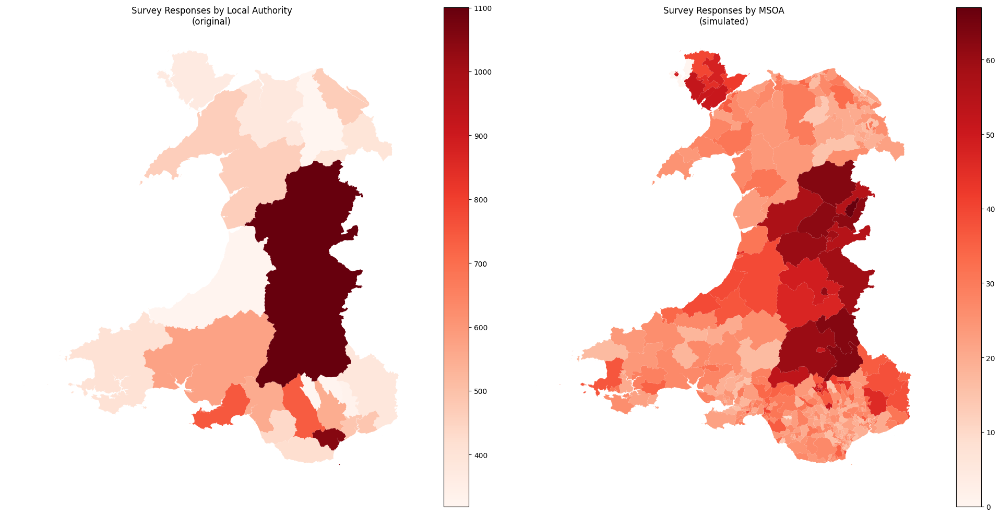

This work example demonstrates the step-by-step of creating the appropriate input files for the Small-Area Estimation (SAE) methods to follow. In the process, we will also address the various decisions that researchers need to make.

## Preparation

### Understanding the tutorial dataset

The survey dataset used in this tutorial is a simulated dataset based on the [*National Survey for Wales 2022-23*](https://datacatalogue.ukdataservice.ac.uk/studies/study/9144#details)-a cross-sectional survey, conducted annually to provide a snapshot of the Welsh population, covering topics include health, education, climate change, visits to the outdoors, public service satisfaction, material deprivation, internet access, and the Welsh language. 

by treating it with *stratified randomisation* and *randomised upsampling* 

:::{.callout-note}
In the original NSW dataset, obtained via UK Data Service, the Local Authority (LA) is the sole spatial identifier and the survey's sampling stratification variable. To both ensure data privacy and create a more granular spatial identifier for tutorial purposes, the example simulated dataset was created using:

- **Stratified randomisation:** Survey responses were first split by Local Authority and their variables were randomised column-wise to preserve totals by Local Authority.
- **Randomised upsampling:** Survey responses were assigned a random MSOA that intersects with their recorded Local Authority to simulate a higher-resolution dataset for tutorial purposes.


::: 

### Defining the estimands

The most important first step is to define the **estimands**, i.e. what is being estimated, for which population, and at what geography. For this tutorial, we specifically want to estimate indicators related to *commuting, bus transport, and walking/cycling behaviour in Wales*. The estimands could be expressed like this:

|Est. #| Measure | Outcome | Target population | Estimation geography |
|---|---|---|---|---|
|1| Mean | Commute distance | Commuters | MSOAs in Wales |
|2| Share | Dissatisfaction with bus services | Adults who rode a bus in the last 12 months | MSOAs in Wales |
|3| Rate | Walking as main transport daily per 1,000 residents | All residents | MSOAs in Wales |

Specifying these elements early is critical as they dictate the technical requirements for the estimation process. For example:

- **Measure:** Estimating a `mean` or `share` can be done directly with a compatible analysis weight. Estimating a population `rate` (per 1k) requires a compatible grossing weight and/or known domain sizes (residents per MSOA).
- **Weight:** Estimating the share of recent adult bus riders dissatisfied with bus services requires a weight calibrated for the adult population, since applying a general population weight would bias the result by including children.
- **Geography:** With a sample size of 11,000 respondents in Wales, if we chose to estimate at the OA level (~10,000 small areas) instead of MSOA, we could leave the vast majority of OAs with zero or one respondent.

In practice, this step is reiterative based on data availability and other restrictions. It is worth starting out with the most relevant estimands and refining them further after diagnosing the quality of the estimation results.

### Preparing indicators and weight variables

The next stage involves preparing the indicator variables and aligning them with the appropriate estimation geography and survey weights, as defined by the estimand.

| Est. # |  Indicator | Variable coding rule | Measure | Estimation geography | Weight variable |
|---|---|---|---|---|---|
|1| `commute_distance` | [`TravWkDist`] Numeric commute distance in miles, non-commuters are coded `NA` | Mean | MSOA | `SampleAdultWeight`, analysis weight |
|2| `bus_nosat` | [`BusOverSat`, `Bus12M`] Binary: `1` if rode a bus in the last 12 months and is fairly or very dissatisfied; `0` if rode a bus in the last 12 months and is not dissatisfied; `NA` otherwise | Share | MSOA | `SampleAdultWeight`, analysis weight |
|3| `freq_walker` | [`AtFrqWlk10`] Binary: `1` if walking for transport daily | Rate (per 1k)| MSOA | `SampleTravelWeight`, analysis weight, to be scaled to an MSOA-level grossing weight |

With this information we can proceed to process the raw survey dataset to produce inputs necessary for the estimation pipeline.

## Practical: Code Implementation

```{r}
library(dplyr)
library(readr)
library(stringr)
library(ggplot2)

# Download the simulated survey microdata into a temp file
survey_file <- file.path(tempdir(), "nsw_2223_msoa_la.csv")
survey_url <- "https://raw.githubusercontent.com/shaunhoang/tutorial-site/main/data/nsw_2223_msoa_la.csv"
download.file(survey_url, survey_file, mode = "wb")

# Download Census data files into a temp folder
census_zip <- tempfile(fileext = ".zip")
census_url <- "https://raw.githubusercontent.com/shaunhoang/tutorial-site/main/data/tutorial-census-data.zip"
download.file(census_url, census_zip, mode = "wb")
unzip(census_zip, exdir = tempdir())
census_path <- tempdir()
```
### Load survey data 
Load the survey datasets and identify the unique identifier of survey respondents, and recode it as `unit_id` for easier handling downstream. For each respondent, the simulated survey microdata also provides two spatial identifiers: Local Authority and MSOA of residence. The three estimands are estimated at MSOA level, while Local Authority remains useful as the survey stratification variable.
```{r}
# Load dataset
nsw_raw <- read_csv(
  survey_file,
  show_col_types = FALSE
) |>
  rename(unit_id = CaseNo)

# tibble of la and msoa code
survey_spatial_ids <- nsw_raw |>
  select(unit_id,la_code,msoa_code)

head(survey_spatial_ids)
```

### Construct Indicators

Next, we can start constructing the indicators from the variables based on the coding rules set out above.

```{r}
# Construct the three indicators
survey_indicators <- nsw_raw |>
  transmute(
    unit_id,
    commute_distance = as.numeric(TravWkDist),
    bus_nosat = case_when(
      Bus12M != 1 ~ NA_real_,
      BusOverSat %in% c(4, 5) ~ 1,  # Fairly or very dissatisfied
      !is.na(BusOverSat) ~ 0,
      TRUE ~ NA_real_
    ),
    freq_walker = case_when(
      is.na(AtFrqWlk10) ~ NA_real_,
      AtFrqWlk10 %in% 1 ~ 1,        # Walk at least daily
      TRUE ~ 0
    )
  )
head(survey_indicators)
```

### Select weight variables

Next, filter for the relevant weight variables from the survey relevant to our estimands.

```{r}
survey_weights <- nsw_raw |>
  transmute(
    unit_id,
    msoa_code,
    SampleAdultWeight,
    SampleTravelWeight
  )
```

`SampleTravelWeight` is the analysis weight for the subsampled active-travel module, from which `freq_walker` was derived. This weight variable was designed to represent the general population of Wales. To estimate the number of freq_walker per 1,000 residents, these analysis weights should be scaled to grossing weights (i.e., `WalesTravelWeight`) using population totals per MSOA available in the UK Census 2021 data as domain sizes.

```{r}
# Load the Welsh MSOA population totals as the domain sizes
domain_sizes_population_msoa <- read_csv(
  file.path(census_path, "census2021-ts007-msoa.csv"),
  show_col_types = FALSE
) |>
  filter(str_starts(`geography code`, "W")) |>
  transmute(
    domain_id = `geography code`,
    domain_name = geography,
    domain_size = `Age: Total; measures: Value`
  )
  
head(domain_sizes_population_msoa)

# Scaling analysis weight into grossing weight (see formula in the previous chapter)
survey_weights <- survey_weights |>
  left_join(
    domain_sizes_population_msoa |>
      select(domain_id, domain_size),
    by = c("msoa_code" = "domain_id")
  ) |>
  group_by(msoa_code) |>
  mutate(
    travel_weight_sum = sum(SampleTravelWeight, na.rm = TRUE),
    WalesTravelWeight = if_else(
      !is.na(SampleTravelWeight) & travel_weight_sum != 0, SampleTravelWeight * domain_size / travel_weight_sum,
      NA_real_
    )
  ) |>
  ungroup() |>
  select(unit_id, SampleAdultWeight, SampleTravelWeight, WalesTravelWeight)

head(survey_weights)
```

### Check missingness

For each indicator, check for missingness overall (number of null values) and whether there are areas with no respondents.

```{r}
# Join the spatial identifiers, coded indicators and calculated weights together
survey_inputs <- survey_spatial_ids |>
  left_join(survey_indicators, by = "unit_id") |>
  left_join(survey_weights, by = "unit_id")

# Calculate non-nulls and coverage for each indicator at estimation geography
indicator_observations <- bind_rows(
  survey_inputs |>
    transmute(
      indicator = "commute_distance",
      domain_id = msoa_code,
      value = commute_distance,
      weight = SampleAdultWeight
    ),
  survey_inputs |>
    transmute(
      indicator = "bus_nosat",
      domain_id = msoa_code,
      value = bus_nosat,
      weight = SampleAdultWeight
    ),
  survey_inputs |>
    transmute(
      indicator = "freq_walker",
      domain_id = msoa_code,
      value = freq_walker,
      weight = WalesTravelWeight
    )
)

indicator_area_summary <- indicator_observations |>
  filter(!is.na(value), !is.na(weight)) |>
  count(indicator, domain_id, name = "non_missing") |>
  group_by(indicator) |>
  summarise(
    geography = "MSOA",
    areas_total = nrow(domain_sizes_population_msoa),
    areas_n_0 = areas_total - n_distinct(domain_id),
    areas_n_lt2 = areas_n_0 + sum(non_missing < 2),
    .groups = "drop"
  )

indicator_area_summary
```
This summary highlights areas with no data (`areas_n_0`) and areas with fewer than two usable observations (`areas_n_lt2`). For two indicators, `bus_nosat` and `commute_distance`, the number of very-low-sample areas is below 10, which is not a major concern at this stage. `freq_walker` has many more very-low-sample areas.

```{r}
indicator_area_counts <- indicator_observations |>
  filter(!is.na(value), !is.na(weight)) |>
  count(indicator, domain_id, name = "non_missing")

ggplot(indicator_area_counts, aes(x = non_missing)) +
  geom_histogram(binwidth = 5, boundary = 0, fill = "#4C78A8", colour = "white") +
  facet_wrap(~ indicator, scales = "free_y") +
  labs(
    x = "Usable observations per MSOA",
    y = "Number of MSOAs"
  ) +
  theme_minimal()
```

This is consistent with the fact that the active-travel questions used to construct `freq_walker` were only asked to a subsample. It will probably benefit the most from model-based estimation later, although the final decision is best made after looking at the direct estimates and their uncertainty in the next step.

### Export

The next workbooks do not depend on local exports from this workbook. However, if preferred, export into your `data/clean/` folder the following components:

Indicator microdata with weight and survey strata

- `ind_weight_commute_distance.csv`, with analysis adult weight;
- `ind_weight_bus_nosat.csv`, with analysis adult weight;
- `ind_weight_freq_walker.csv`, with `WalesTravelWeight`, an MSOA-level grossing weight for the active-travel module.

Each indicator microdata file contains the same key columns:

| Column | Meaning |
|---|---|
| `unit_id` | Survey respondent identifier. |
| `domain_id` | Estimation area ID. |
| `strata` | Survey stratification variable. For NSW, this is the Local Authority, `la_code`. |
| `indicator` | Coded outcome variable. |
| `weight` | Survey weight matched to the estimand. |

```{r}
#| echo: false
output_dir <- file.path("..", "data")
dir.create(output_dir, recursive = TRUE, showWarnings = FALSE)

ind_weight_commute_distance <- survey_inputs |>
  transmute(
    unit_id,
    domain_id = msoa_code,
    strata = la_code,
    indicator = commute_distance,
    weight = SampleAdultWeight
  )

ind_weight_bus_nosat <- survey_inputs |>
  transmute(
    unit_id,
    domain_id = msoa_code,
    strata = la_code,
    indicator = bus_nosat,
    weight = SampleAdultWeight
  )

ind_weight_freq_walker <- survey_inputs |>
  transmute(
    unit_id,
    domain_id = msoa_code,
    strata = la_code,
    indicator = freq_walker,
    weight = WalesTravelWeight
  )

write_csv(
  ind_weight_commute_distance,
  file.path(output_dir, "ind_weight_commute_distance.csv")
)

write_csv(
  ind_weight_bus_nosat,
  file.path(output_dir, "ind_weight_bus_nosat.csv")
)

write_csv(
  ind_weight_freq_walker,
  file.path(output_dir, "ind_weight_freq_walker.csv")
)

# Create data/tutorial-clean-data.zip
data_dir <- file.path("..", "data")
old_wd <- setwd(data_dir)

tryCatch(
  {
    if (file.exists("tutorial-clean-data.zip")) {
      file.remove("tutorial-clean-data.zip")
    }

    utils::zip(
      zipfile = "tutorial-clean-data.zip",
      files = list.files(pattern = "\\.csv$", full.names = TRUE)
    )
  },
  finally = setwd(old_wd)
)

```

